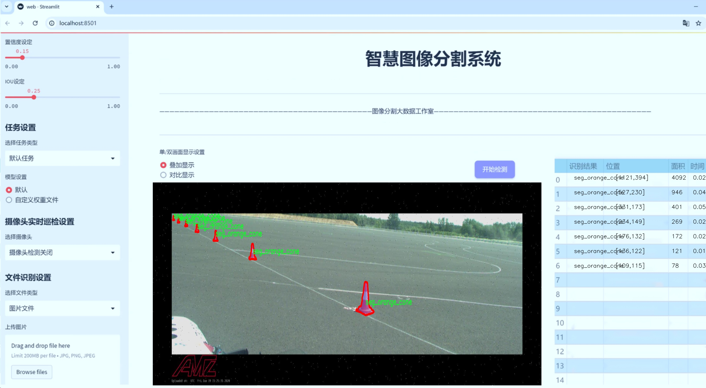
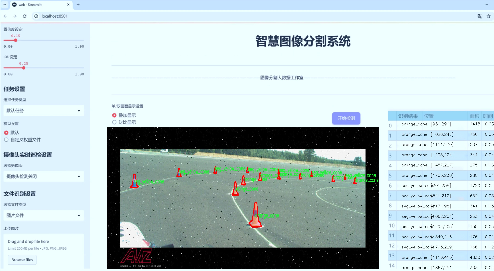
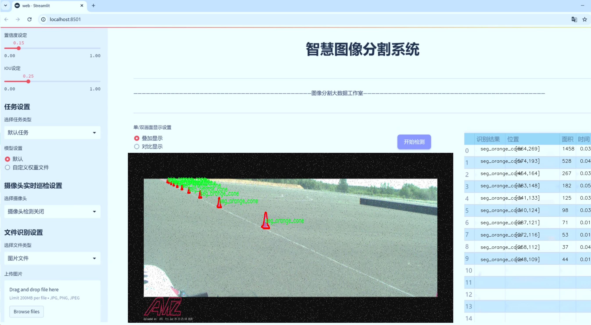
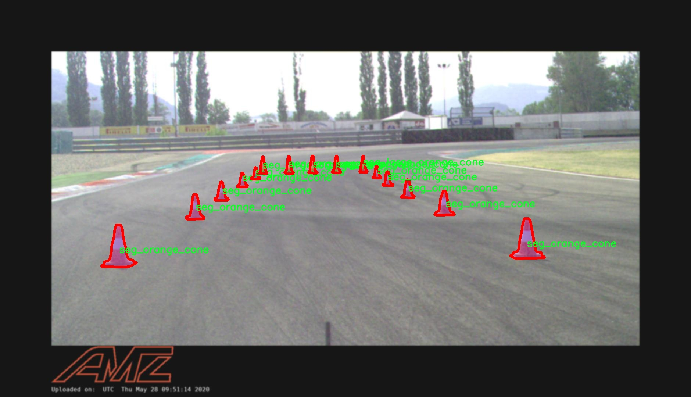
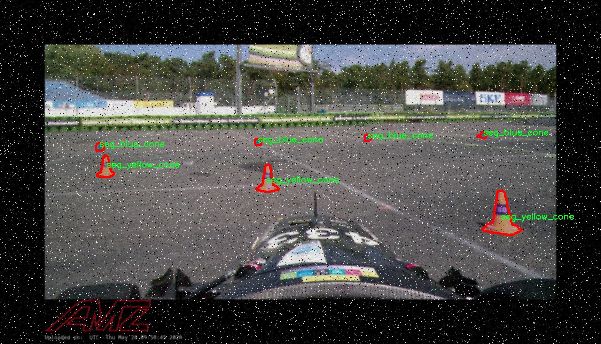
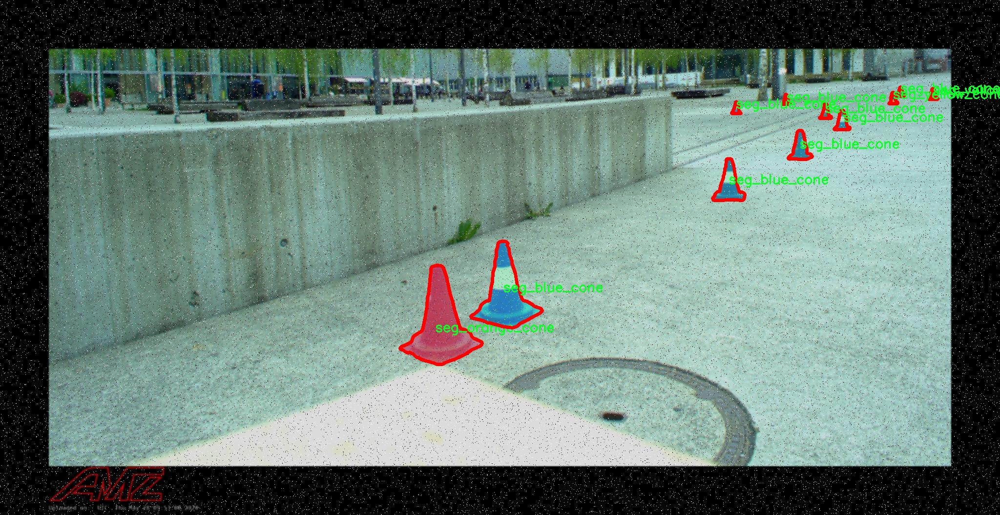
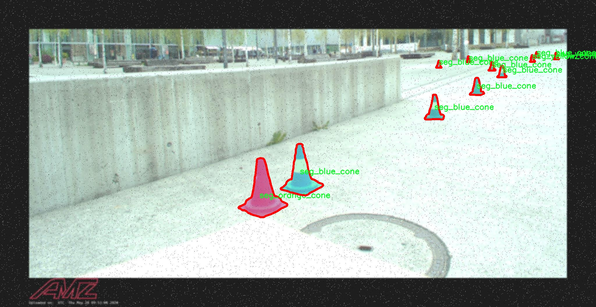
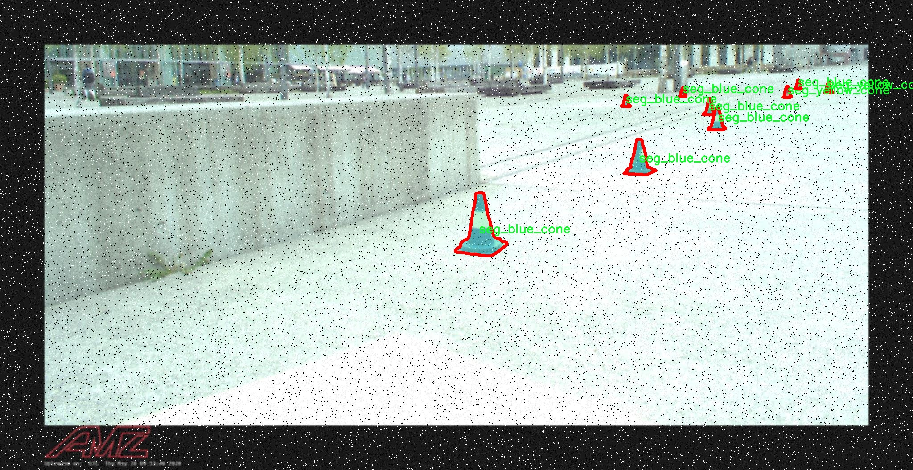

# 交通锥图像分割系统源码＆数据集分享
 [yolov8-seg-HGNetV2＆yolov8-seg-C2f-EMSC等50+全套改进创新点发刊_一键训练教程_Web前端展示]

### 1.研究背景与意义

项目参考[ILSVRC ImageNet Large Scale Visual Recognition Challenge](https://gitee.com/YOLOv8_YOLOv11_Segmentation_Studio/projects)

项目来源[AAAI Global Al lnnovation Contest](https://kdocs.cn/l/cszuIiCKVNis)

研究背景与意义

随着城市化进程的加快，交通管理面临着越来越多的挑战，尤其是在交通安全和交通流量的管理方面。交通锥作为一种重要的交通标志，广泛应用于道路施工、交通管制及事故现场的标识，起到了引导车辆和行人、保障交通安全的重要作用。然而，传统的交通锥管理方式往往依赖人工识别和处理，效率低下且容易出现错误。为了提高交通锥的识别和管理效率，基于计算机视觉的自动化识别系统逐渐成为研究的热点。

近年来，深度学习技术的迅猛发展为图像分割任务提供了新的解决方案。YOLO（You Only Look Once）系列模型以其高效的实时检测能力和较高的准确性，成为了目标检测领域的佼佼者。YOLOv8作为该系列的最新版本，进一步提升了模型的性能和应用范围。然而，针对特定场景的改进和优化仍然是必要的，尤其是在交通锥图像分割这一细分领域。交通锥的种类繁多，颜色和形状各异，这为图像分割任务带来了挑战。因此，基于改进YOLOv8的交通锥图像分割系统的研究具有重要的现实意义。

本研究利用包含1500张图像的fsoco_segmentation_verify数据集，涵盖了10种不同类别的交通锥，包括蓝色锥、大型橙色锥、橙色锥、分割蓝色锥、分割大型橙色锥、分割橙色锥、未知锥、分割黄色锥、未知锥和黄色锥。这些数据不仅丰富了模型的训练样本，也为模型的泛化能力提供了保障。通过对这些多样化的交通锥图像进行深度学习模型的训练和测试，能够有效提升交通锥的自动识别和分割精度，从而为交通管理提供更为智能化的解决方案。

此外，交通锥的图像分割系统在实际应用中还可以与其他智能交通系统相结合，形成一个综合的交通管理平台。例如，通过与智能监控系统的联动，能够实时监测交通锥的状态和位置，及时发现并处理交通隐患。这种智能化的交通管理方式不仅提高了交通管理的效率，也为城市交通的安全性提供了保障。

综上所述，基于改进YOLOv8的交通锥图像分割系统的研究，不仅在理论上丰富了目标检测和图像分割的研究内容，也在实践中为交通管理提供了创新的解决方案。通过对交通锥的高效识别和管理，可以显著提升城市交通的安全性和流畅性，具有重要的社会价值和应用前景。因此，本研究具有重要的学术意义和广泛的应用潜力。

### 2.图片演示







##### 注意：由于此博客编辑较早，上面“2.图片演示”和“3.视频演示”展示的系统图片或者视频可能为老版本，新版本在老版本的基础上升级如下：（实际效果以升级的新版本为准）

  （1）适配了YOLOV8的“目标检测”模型和“实例分割”模型，通过加载相应的权重（.pt）文件即可自适应加载模型。

  （2）支持“图片识别”、“视频识别”、“摄像头实时识别”三种识别模式。

  （3）支持“图片识别”、“视频识别”、“摄像头实时识别”三种识别结果保存导出，解决手动导出（容易卡顿出现爆内存）存在的问题，识别完自动保存结果并导出到tempDir中。

  （4）支持Web前端系统中的标题、背景图等自定义修改，后面提供修改教程。

  另外本项目提供训练的数据集和训练教程,暂不提供权重文件（best.pt）,需要您按照教程进行训练后实现图片演示和Web前端界面演示的效果。

### 3.视频演示

[3.1 视频演示](https://www.bilibili.com/video/BV1dvyZYgERk/)

### 4.数据集信息展示

##### 4.1 本项目数据集详细数据（类别数＆类别名）

nc: 10
names: ['blue_cone', 'large_orange_cone', 'orange_cone', 'seg_blue_cone', 'seg_large_orange_cone', 'seg_orange_cone', 'seg_unknown_cone', 'seg_yellow_cone', 'unknown_cone', 'yellow_cone']


##### 4.2 本项目数据集信息介绍

数据集信息展示

在本研究中，我们采用了名为“fsoco_segmentation_verify”的数据集，以支持对改进YOLOv8-seg模型的交通锥图像分割系统的训练和验证。该数据集专门设计用于处理交通锥的图像分割任务，涵盖了多种类型的交通锥，确保模型能够在多样化的场景中进行有效的识别和分割。数据集包含10个不同的类别，每个类别代表了一种特定类型的交通锥，这些类别的多样性不仅增强了模型的鲁棒性，也提高了其在实际应用中的适应能力。

具体而言，数据集中包含的类别包括：蓝色交通锥（blue_cone）、大型橙色交通锥（large_orange_cone）、橙色交通锥（orange_cone）、分割蓝色交通锥（seg_blue_cone）、分割大型橙色交通锥（seg_large_orange_cone）、分割橙色交通锥（seg_orange_cone）、未知分割交通锥（seg_unknown_cone）、黄色交通锥（yellow_cone）、未知交通锥（unknown_cone）以及分割未知交通锥（seg_unknown_cone）。这些类别的划分不仅反映了交通锥的颜色和尺寸差异，还考虑到了在不同环境下可能出现的各种交通锥类型，确保模型能够在复杂的现实场景中准确识别和分割目标。

数据集的构建过程涉及多种图像采集技术，以确保图像的多样性和代表性。通过在不同的环境条件下拍摄交通锥，数据集涵盖了不同的光照、背景和视角变化。这种多样性对于训练深度学习模型至关重要，因为它能够帮助模型学习到更为广泛的特征，从而提高其在未见数据上的泛化能力。此外，数据集中还包含了大量的标注信息，确保每个图像中的交通锥都被准确地标记和分割，这为模型的训练提供了坚实的基础。

在数据预处理阶段，我们对图像进行了标准化处理，包括尺寸调整、颜色空间转换等，以确保输入数据的一致性。这些预处理步骤不仅提高了模型的训练效率，还有效地减少了因数据不一致性导致的训练误差。通过这些精细的处理，我们希望能够最大限度地发挥数据集的潜力，使得改进YOLOv8-seg模型在交通锥图像分割任务中表现出色。

综上所述，“fsoco_segmentation_verify”数据集为本研究提供了丰富而多样的训练样本，涵盖了多种交通锥类型及其分割标注。这一数据集的使用将为改进YOLOv8-seg模型的训练提供强有力的支持，帮助模型在实际应用中实现高效、准确的交通锥识别与分割。通过充分利用这一数据集，我们期望能够推动交通安全领域的技术进步，为智能交通系统的建设贡献一份力量。











### 5.全套项目环境部署视频教程（零基础手把手教学）

[5.1 环境部署教程链接（零基础手把手教学）](https://www.bilibili.com/video/BV1jG4Ve4E9t/?vd_source=bc9aec86d164b67a7004b996143742dc)


[5.2 安装Python虚拟环境创建和依赖库安装视频教程链接（零基础手把手教学）](https://www.bilibili.com/video/BV1nA4VeYEze/?vd_source=bc9aec86d164b67a7004b996143742dc)

### 6.手把手YOLOV8-seg训练视频教程（零基础小白有手就能学会）

[6.1 手把手YOLOV8-seg训练视频教程（零基础小白有手就能学会）](https://www.bilibili.com/video/BV1cA4VeYETe/?vd_source=bc9aec86d164b67a7004b996143742dc)


按照上面的训练视频教程链接加载项目提供的数据集，运行train.py即可开始训练



     Epoch   gpu_mem       box       obj       cls    labels  img_size
     1/200     0G   0.01576   0.01955  0.007536        22      1280: 100%|██████████| 849/849 [14:42<00:00,  1.04s/it]
               Class     Images     Labels          P          R     mAP@.5 mAP@.5:.95: 100%|██████████| 213/213 [01:14<00:00,  2.87it/s]
                 all       3395      17314      0.994      0.957      0.0957      0.0843

     Epoch   gpu_mem       box       obj       cls    labels  img_size
     2/200     0G   0.01578   0.01923  0.007006        22      1280: 100%|██████████| 849/849 [14:44<00:00,  1.04s/it]
               Class     Images     Labels          P          R     mAP@.5 mAP@.5:.95: 100%|██████████| 213/213 [01:12<00:00,  2.95it/s]
                 all       3395      17314      0.996      0.956      0.0957      0.0845

     Epoch   gpu_mem       box       obj       cls    labels  img_size
     3/200     0G   0.01561    0.0191  0.006895        27      1280: 100%|██████████| 849/849 [10:56<00:00,  1.29it/s]
               Class     Images     Labels          P          R     mAP@.5 mAP@.5:.95: 100%|███████   | 187/213 [00:52<00:00,  4.04it/s]
                 all       3395      17314      0.996      0.957      0.0957      0.0845


### 7.50+种全套YOLOV8-seg创新点代码加载调参视频教程（一键加载写好的改进模型的配置文件）

[7.1 50+种全套YOLOV8-seg创新点代码加载调参视频教程（一键加载写好的改进模型的配置文件）](https://www.bilibili.com/video/BV1Hw4VePEXv/?vd_source=bc9aec86d164b67a7004b996143742dc)

### 8.YOLOV8-seg图像分割算法原理

原始YOLOV8-seg算法原理

YOLOV8-seg算法是YOLO系列目标检测算法的最新进展，旨在通过改进网络结构和训练策略来提高目标检测和分割的性能。该算法基于YOLOv5和YOLOv7的设计理念，结合了多种先进的技术，形成了一个高效、灵活且强大的目标检测框架。YOLOV8-seg不仅支持传统的目标检测任务，还扩展到了实例分割领域，使得算法在处理复杂场景时表现得更加出色。

YOLOV8-seg的网络结构主要由三个部分组成：输入层、主干网络（Backbone）和检测头（Head）。在输入层，算法接收预处理后的图像数据，通常将图像调整为640x640的RGB格式，以便于后续的特征提取和处理。主干网络是YOLOV8-seg的核心部分，负责从输入图像中提取多层次的特征信息。与前几代YOLO算法相比，YOLOV8-seg在主干网络中引入了C2f模块，这一模块是对YOLOv5中的C3模块的改进，结合了YOLOv7中的ELAN思想，增加了更多的残差连接，旨在提高特征提取的效率和准确性。

C2f模块的设计具有重要意义。它通过将特征图分为两个分支进行处理，一个分支直接将特征图传递到后续层，另一个分支则通过多个瓶颈结构进行深度处理。这样的设计不仅提高了网络的表达能力，还有效缓解了深层网络中的梯度消失问题，使得模型在训练过程中能够更好地收敛。C2f模块的输入和输出特征图尺寸保持一致，这一设计确保了特征信息的完整性和连续性，有助于后续的特征融合。

在特征融合方面，YOLOV8-seg采用了PAN-FPN（Path Aggregation Network - Feature Pyramid Network）结构。这一结构通过自下而上的特征融合方式，将来自不同层次的特征图进行有效结合，增强了模型对多尺度目标的检测能力。特征融合不仅提升了模型的鲁棒性，还使得算法在面对复杂背景和不同尺寸目标时能够保持较高的检测精度。

YOLOV8-seg的Head部分则是算法的输出层，负责将经过特征融合后的信息转化为最终的检测结果。与传统的Anchor-Based方法不同，YOLOV8-seg采用了Anchor-Free的设计理念，将分类和回归任务解耦，分别使用不同的分支进行处理。这一创新使得模型在处理目标时更加灵活，能够适应不同形状和尺寸的目标，提高了检测的准确性。

在损失函数的设计上，YOLOV8-seg使用了BCELoss作为分类损失，DFLLoss和CIoULoss作为回归损失。这种组合损失函数能够有效地处理正负样本不平衡的问题，尤其是在面对小目标和难以分类的样本时，能够提升模型的学习效果。此外，YOLOV8-seg在训练过程中引入了动态Task-Aligned Assigner样本分配策略，这一策略根据样本的难易程度动态调整样本的分配，进一步提高了训练的效率和效果。

在数据增强方面，YOLOV8-seg借鉴了YOLOv5的策略，采用了包括马赛克增强、混合增强、空间扰动和颜色扰动等多种手段，以丰富训练数据的多样性，提升模型的泛化能力。通过这些数据增强技术，YOLOV8-seg能够在不同的环境和条件下保持较高的检测性能。

综上所述，YOLOV8-seg算法通过对网络结构的优化、特征融合的增强、损失函数的改进以及数据增强策略的引入，形成了一个高效的目标检测和分割框架。其创新的C2f模块和PAN-FPN结构有效提升了特征提取和融合的能力，使得YOLOV8-seg在处理复杂场景时表现得更加出色。随着YOLO系列算法的不断发展，YOLOV8-seg无疑为目标检测和实例分割领域带来了新的突破和机遇。


### 9.系统功能展示（检测对象为举例，实际内容以本项目数据集为准）

图9.1.系统支持检测结果表格显示

  图9.2.系统支持置信度和IOU阈值手动调节

  图9.3.系统支持自定义加载权重文件best.pt(需要你通过步骤5中训练获得)

  图9.4.系统支持摄像头实时识别

  图9.5.系统支持图片识别

  图9.6.系统支持视频识别

  图9.7.系统支持识别结果文件自动保存

  图9.8.系统支持Excel导出检测结果数据


### 10.50+种全套YOLOV8-seg创新点原理讲解（非科班也可以轻松写刊发刊，V11版本正在科研待更新）

#### 10.1 由于篇幅限制，每个创新点的具体原理讲解就不一一展开，具体见下列网址中的创新点对应子项目的技术原理博客网址【Blog】：


[10.1 50+种全套YOLOV8-seg创新点原理讲解链接](https://gitee.com/qunmasj/good)

#### 10.2 部分改进模块原理讲解(完整的改进原理见上图和技术博客链接)【如果此小节的图加载失败可以通过CSDN或者Github搜索该博客的标题访问原始博客，原始博客图片显示正常】
### 深度学习基础
卷积神经网络通过使用具有共享参数的卷积运算显著降低了模型的计算开销和复杂性。在LeNet、AlexNet和VGG等经典网络的驱动下，卷积神经网络现在已经建立了一个完整的系统，并在深度学习领域形成了先进的卷积神经网络模型。

感受野注意力卷积RFCBAMConv的作者在仔细研究了卷积运算之后获得了灵感。对于分类、目标检测和语义分割任务，一方面，图像中不同位置的对象的形状、大小、颜色和分布是可变的。在卷积操作期间，卷积核在每个感受野中使用相同的参数来提取信息，而不考虑来自不同位置的差分信息。这限制了网络的性能，这已经在最近的许多工作中得到了证实。

另一方面，卷积运算没有考虑每个特征的重要性，这进一步影响了提取特征的有效性，并最终限制了模型的性能。此外，注意力机制允许模型专注于重要特征，这可以增强特征提取的优势和卷积神经网络捕获详细特征信息的能力。因此，注意力机制在深度学习中得到了广泛的应用，并成功地应用于各个领域。

通过研究卷积运算的内在缺陷和注意力机制的特点，作者认为现有的空间注意力机制从本质上解决了卷积运算的参数共享问题，但仍局限于对空间特征的认知。对于较大的卷积核，现有的空间注意力机制并没有完全解决共享参数的问题。此外，他们无法强调感受野中每个特征的重要性，例如现有的卷积块注意力模块（CBAM）和 Coordinate注意力（CA）。

因此，[参考该博客提出了一种新的感受野注意力机制（RFA）](https://qunmasj.com)，它完全解决了卷积核共享参数的问题，并充分考虑了感受野中每个特征的重要性。通过RFA设计的卷积运算（RFAConv）是一种新的卷积运算，可以取代现有神经网络中的标准卷积运算。RFAConv通过添加一些参数和计算开销来提高网络性能。

大量关于Imagnet-1k、MS COCO和VOC的实验已经证明了RFAConv的有效性。作为一种由注意力构建的新型卷积运算，它超过了由CAM、CBAM和CA构建的卷积运算（CAMConv、CBAMConv、CAConv）以及标准卷积运算。

此外，为了解决现有方法提取感受野特征速度慢的问题，提出了一种轻量级操作。在构建RFAConv的过程中，再次设计了CA和CBAM的升级版本，并进行了相关实验。作者认为当前的空间注意力机制应该将注意力放在感受野空间特征上，以促进当前空间注意力机制的发展，并再次增强卷积神经网络架构的优势。


### 卷积神经网络架构
出色的神经网络架构可以提高不同任务的性能。卷积运算作为卷积神经网络的一种基本运算，推动了人工智能的发展，并为车辆检测、无人机图像、医学等先进的网络模型做出了贡献。He等人认为随着网络深度的增加，该模型将变得难以训练并产生退化现象，因此他们提出了残差连接来创新卷积神经网络架构的设计。Huang等人通过重用特征来解决网络梯度消失问题，增强了特征信息，他们再次创新了卷积神经网络架构。

通过对卷积运算的详细研究，Dai等人认为，具有固定采样位置的卷积运算在一定程度上限制了网络的性能，因此提出了Deformable Conv，通过学习偏移来改变卷积核的采样位置。在Deformable Conv的基础上，再次提出了Deformable Conv V2和Deformable Conv V3，以提高卷积网络的性能。

Zhang等人注意到，组卷积可以减少模型的参数数量和计算开销。然而，少于组内信息的交互将影响最终的网络性能。1×1的卷积可以与信息相互作用。然而，这将带来更多的参数和计算开销，因此他们提出了无参数的“通道Shuffle”操作来与组之间的信息交互。

Ma等人通过实验得出结论，对于参数较少的模型，推理速度不一定更快，对于计算量较小的模型，推理也不一定更快。经过仔细研究提出了Shufflenet V2。

YOLO将输入图像划分为网格，以预测对象的位置和类别。经过不断的研究，已经提出了8个版本的基于YOLO的目标检测器，如YOLOv5、YOLOv7、YOLOv8等。上述卷积神经网络架构已经取得了巨大的成功。然而，它们并没有解决提取特征过程中的参数共享问题。本文的工作从注意力机制开始，从一个新的角度解决卷积参数共享问题。

### 注意力机制
注意力机制被用作一种提高网络模型性能的技术，使其能够专注于关键特性。注意力机制理论已经在深度学习中建立了一个完整而成熟的体系。Hu等人提出了一种Squeeze-and-Excitation（SE）块，通过压缩特征来聚合全局通道信息，从而获得与每个通道对应的权重。Wang等人认为，当SE与信息交互时，单个通道和权重之间的对应关系是间接的，因此设计了高效通道注Efficient Channel Attention力（ECA），并用自适应kernel大小的一维卷积取代了SE中的全连接（FC）层。Woo等人提出了卷积块注意力模块（CBAM），它结合了通道注意力和空间注意力。作为一个即插即用模块，它可以嵌入卷积神经网络中，以提高网络性能。

尽管SE和CBAM已经提高了网络的性能。Hou等人仍然发现压缩特征在SE和CBAM中丢失了太多信息。因此，他们提出了轻量级Coordinate注意力（CA）来解决SE和CBAM中的问题。Fu等人计了一个空间注意力模块和通道注意力模块，用于扩展全卷积网络（FCN），分别对空间维度和通道维度的语义相关性进行建模。Zhang等人在通道上生成不同尺度的特征图，以建立更有效的通道注意力机制。

本文从一个新的角度解决了标准卷积运算的参数共享问题。这就是将注意力机制结合起来构造卷积运算。尽管目前的注意力机制已经获得了良好的性能，但它们仍然没有关注感受野的空间特征。因此，设计了具有非共享参数的RFA卷积运算，以提高网络的性能。


#### 回顾标准卷积
以标准卷积运算为基础构建卷积神经网络，通过共享参数的滑动窗口提取特征信息，解决了全连接层构建的神经网络的固有问题（即参数数量大、计算开销高）。

设表示输入特征图，其中、和分别表示特征图的通道数、高度和宽度。为了能够清楚地展示卷积核提取特征信息的过程，以为例。提取每个感受野slider的特征信息的卷积运算可以表示如下：


这里，表示在每次卷积slider操作之后获得的值，表示在每个slider内的相应位置处的像素值。表示卷积核，表示卷积核中的参数数量，表示感受野slider的总数。

可以看出，每个slider内相同位置的特征共享相同的参数。因此，标准的卷积运算无法感知不同位置带来的差异信息，这在一定程度上限制了卷积神经网络的性能。

#### 回顾空间注意力
目前，空间注意力机制使用通过学习获得的注意力图来突出每个特征的重要性。与上一节类似，以为例。突出关键特征的空间注意力机制可以简单地表达如下：


这里，表示在加权运算之后获得的值。和分别表示输入特征图和学习注意力图在不同位置的值，是输入特征图的高度和宽度的乘积，表示像素值的总数。一般来说，整个过程可以简单地表示在图1中。


#### 空间注意力与标准卷积
众所周知，将注意力机制引入卷积神经网络可以提高网络的性能。通过标准的卷积运算和对现有空间注意力机制的仔细分析。作者认为空间注意力机制本质上解决了卷积神经网络的固有缺点，即共享参数的问题。

目前，该模型最常见的卷积核大小为1×1和3×3。引入空间注意力机制后用于提取特征的卷积操作是1×1或3×3卷积操作。这个过程可以直观地显示出来。空间注意力机制被插入到1×1卷积运算的前面。通过注意力图对输入特征图进行加权运算（Re-weight“×”），最后通过1×1卷积运算提取感受野的slider特征信息。

整个过程可以简单地表示如下：


 

这里，卷积核仅表示一个参数值。如果将的值作为一个新的卷积核参数，那么有趣的是，通过1×1卷积运算提取特征时的参数共享问题得到了解决。然而，空间注意力机制的传说到此结束。当空间注意力机制被插入到3×3卷积运算的前面时。具体情况如下：


如上所述，如果取的值。作为一种新的卷积核参数，上述方程完全解决了大规模卷积核的参数共享问题。然而，最重要的一点是，卷积核在每个感受野slider中提取将共享部分特征的特征。换句话说，在每个感受野slider内都会有重叠。

经过仔细分析发现，，…，空间注意力图的权重在每个slider内共享。因此，空间注意机制不能解决大规模卷积核共享参数的问题，因为它们不注意感受野的空间特征。在这种情况下，空间注意力机制是有限的。
#### 创新空间注意力与标准卷积
RFA是为了解决空间注意力机制问题而提出的，创新了空间注意力。使用与RFA相同的思想，一系列空间注意力机制可以再次提高性能。RFA设计的卷积运算可以被视为一种轻量级的即插即用模块，以取代标准卷积，从而提高卷积神经网络的性能。因此，作者认为空间注意力机制和标准卷积在未来将有一个新的春天。

感受野的空间特征：

现在给出感受野空间特征的定义。它是专门为卷积核设计的，并根据kernel大小动态生成，如图2所示，以3×3卷积核为例。


在图2中，“空间特征”表示原始特征图，等于空间特征。“感受野空间特征”表示变换后的特征，该特征由每个感受野slider滑块组成，并且不重叠。也就是说，“感受野空间特征”中的每个3×3大小的slider表示提取原始3×3卷积特征时所有感觉野slider的特征。

#### 感受野注意力卷积(RFA):

关于感受野空间特征，该博客的作者提出了感受野注意（RFA），它不仅强调了感受野slider内各种特征的重要性，而且还关注感受野空间特性，以彻底解决卷积核参数共享的问题。感受野空间特征是根据卷积核的大小动态生成的，因此，RFA是卷积的固定组合，不能脱离卷积运算的帮助，卷积运算同时依赖RFA来提高性能。

因此，作者提出了感受野注意力卷积（RFAConv）。具有3×3大小卷积核的RFAConv的总体结构如图3所示。


目前，提取感受野特征最常用的方法速度较慢，因此经过不断探索提出了一种快速的方法，通过分组卷积来取代原来的方法。

具体来说，根据感受野大小，使用相应的组卷积大小来动态生成展开特征。尽管与原始的无参数方法（如Pytorch提供的nn.Unfld()）相比，该方法添加了一些参数，但速度要快得多。

注意：正如在上一节中提到的，当原始的3×3卷积核提取特征时，感受野空间特征中的每个3×3大小的窗口表示所有感受野滑块的特征。但在快速分组卷积提取感受野特征后，由于原始方法太慢，它们会被映射到新的特征中。

最近的一些工作已经证明信息交互可以提高网络性能。类似地，对于RFAConv，与感受野特征信息交互以学习注意力图可以提高网络性能，但与每个感受野特征交互将带来额外的计算开销。为了确保少量的计算开销和参数数量，通过探索使用AvgPool池化每个感受野特征的全局信息，然后通过1×1组卷积运算与信息交互。最后，softmax用于强调感受野特征中每个特征的重要性。通常，RFA的计算可以表示为：


表示分组卷积，表示卷积核的大小，代表规范化，表示输入特征图，是通过将注意力图与变换的感受野空间特征相乘而获得的。

与CBAM和CA不同，RFA可以为每个感受野特征生成注意力图。标准卷积受到卷积神经网络性能的限制，因为共享参数的卷积运算对位置带来的差异信息不敏感。RFA完全可以解决这个问题，具体细节如下：


由于RFA获得的特征图是“调整形状”后不重叠的感受野空间特征，因此通过池化每个感受野滑块的特征信息来学习学习的注意力图。换句话说，RFA学习的注意力图不再在每个感受野slider内共享，并且是有效的。这完全解决了现有的CA和CBAM对大尺寸kernel的注意力机制中的参数共享问题。

同时，RFA给标准卷积核带来了相当大的好处，但调整形状后，特征的高度和宽度是k倍，需要进行k×k的stride卷积运算，才能提取特征信息。RFAConv创新了标准卷积运算。

此外，空间注意力机制将得到升级，因为作者认为现有的空间注意力机制应该专注于感受野空间特征，以提高网络的性能。众所周知，基于自注意力机制的网络模型取得了巨大的成功，因为它解决了卷积参数共享的问题，并对远程信息进行了建模，但基于自注意力机理的方法给模型带来了巨大的计算开销和复杂性。作者认为通过将一些现有空间注意力机制的注意力放在感受野空间特征中，它以轻量级的方式解决了自注意力机制的问题。

答案如下：

将关注感受野空间特征的空间注意力与卷积相匹配，完全解决了卷积参数共享的问题；

当前的空间注意力机制本身具有考虑远距离信息的特点，它们通过全局平均池化或全局最大池化来获得全局信息，这在一定程度上考虑了远距离信息。


为此，作者设计了一种新的CBAM和CA，称为RFACBAM和RFACA，它专注于感受野的空间特征。与RFA类似，使用stride为k的k×k的最终卷积运算来提取特征信息，具体结构如图4和图5所示，将这2种新的卷积方法称为RFCBAMConv和RFCAConv。比较原始的CBAM，使用SE注意力来代替RFCBAM中的CAM。因为这样可以减少计算开销。


此外，在RFCBAM中，通道和空间注意力不是在单独的步骤中执行的，因为通道和空间注意力是同时加权的，从而允许在每个通道上获得的注意力图是不同的。


### 11.项目核心源码讲解（再也不用担心看不懂代码逻辑）

#### 11.1 ultralytics\utils\dist.py

以下是经过精简和注释的核心代码部分：

```python
import os
import re
import shutil
import socket
import sys
import tempfile
from pathlib import Path

from . import USER_CONFIG_DIR
from .torch_utils import TORCH_1_9

def find_free_network_port() -> int:
    """
    查找本地主机上可用的网络端口。

    在单节点训练时，避免连接到真实的主节点，但需要设置
    `MASTER_PORT` 环境变量时非常有用。
    """
    with socket.socket(socket.AF_INET, socket.SOCK_STREAM) as s:
        s.bind(('127.0.0.1', 0))  # 绑定到本地地址和随机端口
        return s.getsockname()[1]  # 返回绑定的端口号


def generate_ddp_file(trainer):
    """生成 DDP 文件并返回其文件名。"""
    # 获取训练器的模块和类名
    module, name = f'{trainer.__class__.__module__}.{trainer.__class__.__name__}'.rsplit('.', 1)

    # 构建 DDP 文件内容
    content = f'''overrides = {vars(trainer.args)} \nif __name__ == "__main__":
    from {module} import {name}
    from ultralytics.utils import DEFAULT_CFG_DICT

    cfg = DEFAULT_CFG_DICT.copy()
    cfg.update(save_dir='')   # 处理额外的 'save_dir' 键
    trainer = {name}(cfg=cfg, overrides=overrides)
    trainer.train()'''
    
    # 创建 DDP 目录
    (USER_CONFIG_DIR / 'DDP').mkdir(exist_ok=True)
    
    # 创建临时文件并写入内容
    with tempfile.NamedTemporaryFile(prefix='_temp_',
                                     suffix=f'{id(trainer)}.py',
                                     mode='w+',
                                     encoding='utf-8',
                                     dir=USER_CONFIG_DIR / 'DDP',
                                     delete=False) as file:
        file.write(content)  # 写入内容到临时文件
    return file.name  # 返回临时文件名


def generate_ddp_command(world_size, trainer):
    """生成并返回分布式训练的命令。"""
    import __main__  # 本地导入以避免潜在问题
    if not trainer.resume:
        shutil.rmtree(trainer.save_dir)  # 删除保存目录

    file = str(Path(sys.argv[0]).resolve())  # 获取当前脚本的绝对路径
    # 定义安全的文件名模式
    safe_pattern = re.compile(r'^[a-zA-Z0-9_. /\\-]{1,128}$')  
    # 检查文件名是否安全且存在，并且以 .py 结尾
    if not (safe_pattern.match(file) and Path(file).exists() and file.endswith('.py')):
        file = generate_ddp_file(trainer)  # 生成 DDP 文件

    # 根据 PyTorch 版本选择分布式命令
    dist_cmd = 'torch.distributed.run' if TORCH_1_9 else 'torch.distributed.launch'
    port = find_free_network_port()  # 查找可用端口
    # 构建命令
    cmd = [sys.executable, '-m', dist_cmd, '--nproc_per_node', f'{world_size}', '--master_port', f'{port}', file]
    return cmd, file  # 返回命令和文件名


def ddp_cleanup(trainer, file):
    """如果创建了临时文件，则删除它。"""
    if f'{id(trainer)}.py' in file:  # 检查文件名是否包含临时文件后缀
        os.remove(file)  # 删除临时文件
```

### 代码分析：
1. **查找可用端口**：`find_free_network_port` 函数用于查找本地可用的网络端口，适用于设置分布式训练的 `MASTER_PORT` 环境变量。
2. **生成 DDP 文件**：`generate_ddp_file` 函数创建一个临时文件，内容包含训练器的配置信息和训练逻辑，方便分布式训练时使用。
3. **生成分布式命令**：`generate_ddp_command` 函数根据训练器的状态和当前脚本的路径生成分布式训练的命令，确保在分布式环境中正确运行。
4. **清理临时文件**：`ddp_cleanup` 函数用于删除在训练过程中生成的临时文件，保持文件系统的整洁。

这个文件是一个用于分布式训练的工具模块，主要涉及到一些网络端口的查找、动态生成训练脚本以及构建分布式训练命令的功能。

首先，文件导入了一些必要的库，包括操作系统相关的库、正则表达式库、网络套接字库、临时文件库等。这些库为后续的功能实现提供了支持。

接下来，定义了一个函数 `find_free_network_port`，它的作用是查找本地主机上一个可用的网络端口。这个功能在单节点训练时非常有用，因为在这种情况下，我们不需要连接到一个真实的主节点，但仍然需要设置 `MASTER_PORT` 环境变量。函数通过创建一个 TCP 套接字并绑定到一个随机端口来实现这一点，返回的就是这个可用的端口号。

然后是 `generate_ddp_file` 函数，它用于生成一个 DDP（Distributed Data Parallel）文件并返回其文件名。该函数首先获取传入的 `trainer` 对象的类模块和名称，然后构建一个 Python 脚本的内容，内容中包含了训练参数的覆盖和训练过程的调用。接着，函数在用户配置目录下创建一个名为 `DDP` 的文件夹（如果不存在的话），并使用临时文件的方式将生成的内容写入到一个新的 Python 文件中，最后返回这个文件的名称。

接着是 `generate_ddp_command` 函数，它用于生成并返回一个用于分布式训练的命令。该函数首先检查 `trainer` 对象是否需要恢复训练，如果不需要，则删除保存目录。然后，它获取当前脚本的绝对路径，并使用正则表达式确保这个路径是安全的（即符合特定的字符和长度限制）。如果路径不符合要求，函数会调用 `generate_ddp_file` 来生成一个新的 DDP 文件。接下来，函数根据 PyTorch 的版本选择合适的分布式运行命令，并调用 `find_free_network_port` 来获取一个可用的端口。最终，构建出一个命令列表并返回，同时也返回生成的文件名。

最后，`ddp_cleanup` 函数用于清理临时文件。如果生成的临时文件名中包含 `trainer` 对象的 ID，函数会将其删除，以保持文件系统的整洁。

总体来说，这个模块提供了一些实用的功能，帮助用户在使用 Ultralytics YOLO 进行分布式训练时，简化了配置和命令生成的过程。

#### 11.2 ultralytics\trackers\basetrack.py

以下是代码中最核心的部分，并附上详细的中文注释：

```python
from collections import OrderedDict
import numpy as np

class TrackState:
    """跟踪状态的枚举类，表示对象跟踪的不同状态。"""
    New = 0      # 新跟踪
    Tracked = 1  # 正在跟踪
    Lost = 2     # 跟踪丢失
    Removed = 3  # 跟踪已移除

class BaseTrack:
    """对象跟踪的基类，处理基本的跟踪属性和操作。"""

    _count = 0  # 全局跟踪ID计数器

    track_id = 0  # 当前跟踪的ID
    is_activated = False  # 跟踪是否被激活
    state = TrackState.New  # 当前跟踪状态，初始为新跟踪

    history = OrderedDict()  # 跟踪历史记录
    features = []  # 特征列表
    curr_feature = None  # 当前特征
    score = 0  # 跟踪得分
    start_frame = 0  # 开始帧
    frame_id = 0  # 当前帧ID
    time_since_update = 0  # 自上次更新以来的时间

    # 多摄像头跟踪位置
    location = (np.inf, np.inf)  # 初始位置为无穷大

    @property
    def end_frame(self):
        """返回跟踪的最后帧ID。"""
        return self.frame_id

    @staticmethod
    def next_id():
        """递增并返回全局跟踪ID计数器。"""
        BaseTrack._count += 1
        return BaseTrack._count

    def activate(self, *args):
        """激活跟踪，使用提供的参数。"""
        raise NotImplementedError  # 该方法需要在子类中实现

    def predict(self):
        """预测跟踪的下一个状态。"""
        raise NotImplementedError  # 该方法需要在子类中实现

    def update(self, *args, **kwargs):
        """使用新的观测值更新跟踪。"""
        raise NotImplementedError  # 该方法需要在子类中实现

    def mark_lost(self):
        """将跟踪标记为丢失。"""
        self.state = TrackState.Lost

    def mark_removed(self):
        """将跟踪标记为已移除。"""
        self.state = TrackState.Removed

    @staticmethod
    def reset_id():
        """重置全局跟踪ID计数器。"""
        BaseTrack._count = 0
```

### 代码核心部分说明：
1. **TrackState 类**：定义了跟踪状态的枚举，包括新跟踪、正在跟踪、丢失和已移除状态。
2. **BaseTrack 类**：这是一个对象跟踪的基类，包含了跟踪的基本属性和方法。
   - `track_id`：每个跟踪对象的唯一标识符。
   - `is_activated`：标记跟踪是否被激活。
   - `state`：当前跟踪状态，初始为新跟踪。
   - `history` 和 `features`：用于存储跟踪历史和特征信息。
   - `next_id` 方法：用于生成新的跟踪ID。
   - `activate`、`predict` 和 `update` 方法：这些方法需要在子类中实现，分别用于激活跟踪、预测下一个状态和更新跟踪。
   - `mark_lost` 和 `mark_removed` 方法：用于标记跟踪状态为丢失或已移除。
   - `reset_id` 方法：用于重置全局跟踪ID计数器。

这个程序文件是一个用于对象跟踪的基础类，属于Ultralytics YOLO项目的一部分。文件中定义了一个枚举类`TrackState`，用于表示对象跟踪的不同状态，包括新建（New）、跟踪中（Tracked）、丢失（Lost）和已移除（Removed）。这些状态有助于在跟踪过程中管理对象的生命周期。

接下来，定义了一个名为`BaseTrack`的类，这是一个对象跟踪的基类，负责处理基本的跟踪属性和操作。该类包含多个属性，例如`track_id`（跟踪ID）、`is_activated`（是否激活）、`state`（当前状态）、`history`（跟踪历史）、`features`（特征）、`curr_feature`（当前特征）、`score`（得分）、`start_frame`（起始帧）、`frame_id`（当前帧ID）和`time_since_update`（自上次更新以来的时间）。此外，还有一个`location`属性，用于表示多摄像头环境下的位置信息。

类中定义了一个只读属性`end_frame`，用于返回跟踪的最后一帧ID。`next_id`是一个静态方法，用于递增并返回全局跟踪ID计数器，以确保每个跟踪对象都有唯一的标识符。

`BaseTrack`类还定义了几个方法，包括`activate`、`predict`和`update`，这些方法是用于激活跟踪、预测下一个状态和更新跟踪的功能，但它们都抛出了`NotImplementedError`，意味着这些方法需要在子类中实现。

此外，类中有两个方法`mark_lost`和`mark_removed`，分别用于将跟踪状态标记为丢失和已移除。最后，`reset_id`是一个静态方法，用于重置全局跟踪ID计数器，可能在需要重新开始跟踪时使用。

总的来说，这个文件为对象跟踪提供了一个基础框架，允许开发者在此基础上扩展具体的跟踪算法和实现。

#### 11.3 ui.py

以下是保留的核心代码部分，并附上详细的中文注释：

```python
import sys
import subprocess

def run_script(script_path):
    """
    使用当前 Python 环境运行指定的脚本。

    Args:
        script_path (str): 要运行的脚本路径

    Returns:
        None
    """
    # 获取当前 Python 解释器的路径
    python_path = sys.executable

    # 构建运行命令，使用 streamlit 运行指定的脚本
    command = f'"{python_path}" -m streamlit run "{script_path}"'

    # 执行命令
    result = subprocess.run(command, shell=True)
    # 检查命令执行结果，如果返回码不为0，则表示执行出错
    if result.returncode != 0:
        print("脚本运行出错。")

# 实例化并运行应用
if __name__ == "__main__":
    # 指定要运行的脚本路径
    script_path = "web.py"  # 这里可以替换为实际的脚本路径

    # 调用函数运行脚本
    run_script(script_path)
```

### 代码注释说明：
1. **导入模块**：
   - `sys`：用于访问与 Python 解释器相关的变量和函数。
   - `subprocess`：用于执行外部命令和程序。

2. **定义 `run_script` 函数**：
   - 此函数接收一个脚本路径作为参数，并使用当前 Python 环境来运行该脚本。

3. **获取 Python 解释器路径**：
   - `sys.executable` 返回当前 Python 解释器的路径，用于构建执行命令。

4. **构建命令**：
   - 使用 `streamlit` 模块运行指定的脚本，构建命令字符串。

5. **执行命令**：
   - `subprocess.run` 方法用于执行构建的命令，并返回执行结果。

6. **检查执行结果**：
   - 如果返回码不为0，表示脚本运行出错，打印错误信息。

7. **主程序入口**：
   - 使用 `if __name__ == "__main__":` 确保只有在直接运行该脚本时才会执行以下代码。
   - 指定要运行的脚本路径，并调用 `run_script` 函数执行该脚本。

这个程序文件名为 `ui.py`，主要功能是通过当前的 Python 环境来运行一个指定的脚本，具体是使用 Streamlit 框架来启动一个 Web 应用。

首先，程序导入了必要的模块，包括 `sys`、`os` 和 `subprocess`。其中，`sys` 模块用于访问与 Python 解释器相关的变量和函数，`os` 模块提供了与操作系统交互的功能，而 `subprocess` 模块则用于创建新进程、连接到它们的输入/输出/错误管道，并获取它们的返回码。

接下来，程序从 `QtFusion.path` 模块中导入了 `abs_path` 函数，这个函数的作用是获取文件的绝对路径。

在 `run_script` 函数中，程序接受一个参数 `script_path`，这是要运行的脚本的路径。函数内部首先获取当前 Python 解释器的路径，并将其存储在 `python_path` 变量中。然后，构建一个命令字符串，使用 `streamlit run` 命令来运行指定的脚本。接着，使用 `subprocess.run` 方法执行这个命令，并通过 `shell=True` 参数允许在 shell 中执行命令。

如果脚本运行的返回码不为零，表示运行过程中出现了错误，程序会打印出“脚本运行出错。”的提示信息。

在文件的最后部分，程序通过 `if __name__ == "__main__":` 语句来确保只有在直接运行该文件时才会执行以下代码。这里指定了要运行的脚本路径，调用 `abs_path` 函数获取 `web.py` 的绝对路径，并最终调用 `run_script` 函数来执行这个脚本。

总的来说，这个程序的主要功能是封装了一个简单的接口，通过命令行来启动一个基于 Streamlit 的 Web 应用，便于用户在当前的 Python 环境中运行指定的脚本。

#### 11.4 ultralytics\nn\backbone\CSwomTramsformer.py

以下是代码中最核心的部分，并附上详细的中文注释：

```python
import torch
import torch.nn as nn
import numpy as np

class Mlp(nn.Module):
    """多层感知机（MLP）模块"""
    def __init__(self, in_features, hidden_features=None, out_features=None, act_layer=nn.GELU, drop=0.):
        super().__init__()
        out_features = out_features or in_features  # 输出特征数
        hidden_features = hidden_features or in_features  # 隐藏层特征数
        self.fc1 = nn.Linear(in_features, hidden_features)  # 第一层线性变换
        self.act = act_layer()  # 激活函数
        self.fc2 = nn.Linear(hidden_features, out_features)  # 第二层线性变换
        self.drop = nn.Dropout(drop)  # Dropout层

    def forward(self, x):
        """前向传播"""
        x = self.fc1(x)  # 线性变换
        x = self.act(x)  # 激活
        x = self.drop(x)  # Dropout
        x = self.fc2(x)  # 线性变换
        x = self.drop(x)  # Dropout
        return x

class LePEAttention(nn.Module):
    """带有位置编码的注意力机制"""
    def __init__(self, dim, resolution, idx, split_size=7, num_heads=8, attn_drop=0.):
        super().__init__()
        self.dim = dim  # 输入特征维度
        self.resolution = resolution  # 输入分辨率
        self.split_size = split_size  # 切分窗口的大小
        self.num_heads = num_heads  # 注意力头数
        head_dim = dim // num_heads  # 每个头的维度
        self.scale = head_dim ** -0.5  # 缩放因子
        self.get_v = nn.Conv2d(dim, dim, kernel_size=3, stride=1, padding=1, groups=dim)  # 卷积用于获取v

        self.attn_drop = nn.Dropout(attn_drop)  # 注意力Dropout

    def im2cswin(self, x):
        """将输入图像转换为窗口格式"""
        B, N, C = x.shape  # B: 批量大小, N: 令牌数, C: 特征维度
        H = W = int(np.sqrt(N))  # 计算高度和宽度
        x = x.transpose(-2, -1).contiguous().view(B, C, H, W)  # 变换形状
        x = img2windows(x, self.split_size, self.split_size)  # 切分窗口
        return x

    def forward(self, qkv):
        """前向传播"""
        q, k, v = qkv  # 分别获取查询、键、值
        q = self.im2cswin(q)  # 将q转换为窗口格式
        k = self.im2cswin(k)  # 将k转换为窗口格式
        v = self.get_v(v)  # 通过卷积获取v

        q = q * self.scale  # 缩放q
        attn = (q @ k.transpose(-2, -1))  # 计算注意力分数
        attn = nn.functional.softmax(attn, dim=-1)  # softmax归一化
        attn = self.attn_drop(attn)  # 应用Dropout

        x = attn @ v  # 计算输出
        return x

class CSWinBlock(nn.Module):
    """CSWin Transformer的基本块"""
    def __init__(self, dim, num_heads, split_size=7, mlp_ratio=4.):
        super().__init__()
        self.dim = dim  # 输入特征维度
        self.num_heads = num_heads  # 注意力头数
        self.split_size = split_size  # 切分窗口的大小
        self.qkv = nn.Linear(dim, dim * 3)  # 线性层用于生成q, k, v
        self.attn = LePEAttention(dim, resolution=split_size, idx=0, num_heads=num_heads)  # 注意力层
        self.mlp = Mlp(in_features=dim, hidden_features=int(dim * mlp_ratio), out_features=dim)  # MLP层

    def forward(self, x):
        """前向传播"""
        qkv = self.qkv(x).reshape(x.shape[0], -1, 3, self.dim).permute(2, 0, 1, 3)  # 生成q, k, v
        x = self.attn(qkv)  # 通过注意力层
        x = x + self.mlp(x)  # 加上MLP的输出
        return x

class CSWinTransformer(nn.Module):
    """CSWin Transformer模型"""
    def __init__(self, img_size=640, in_chans=3, num_classes=1000, embed_dim=96, depth=[2, 2, 6, 2]):
        super().__init__()
        self.embed_dim = embed_dim  # 嵌入维度
        self.stage1_conv_embed = nn.Conv2d(in_chans, embed_dim, kernel_size=7, stride=4, padding=3)  # 初始卷积层
        self.stage1 = nn.ModuleList([CSWinBlock(dim=embed_dim, num_heads=12) for _ in range(depth[0])])  # 第一阶段的CSWin块

    def forward(self, x):
        """前向传播"""
        x = self.stage1_conv_embed(x)  # 初始卷积嵌入
        for blk in self.stage1:
            x = blk(x)  # 通过每个CSWin块
        return x

# 示例代码
if __name__ == '__main__':
    inputs = torch.randn((1, 3, 640, 640))  # 随机输入
    model = CSWinTransformer()  # 创建模型
    res = model(inputs)  # 前向传播
    print(res.size())  # 输出结果的尺寸
```

### 代码说明：
1. **Mlp类**：实现了一个简单的多层感知机，包括两层线性变换和激活函数。
2. **LePEAttention类**：实现了带有位置编码的注意力机制，包含了将输入转换为窗口格式的功能。
3. **CSWinBlock类**：构建了CSWin Transformer的基本块，包含了注意力层和MLP层。
4. **CSWinTransformer类**：整体模型的定义，包含了初始卷积层和多个CSWin块的组合。

该代码展示了CSWin Transformer的核心结构和前向传播过程。

这个程序文件实现了一个名为 CSWin Transformer 的深度学习模型，主要用于计算机视觉任务。该模型由多个模块组成，包括 Mlp、LePEAttention、CSWinBlock、Merge_Block 和 CSWinTransformer。以下是对各个部分的详细说明。

首先，文件导入了必要的库，包括 PyTorch 和一些用于模型构建的工具。CSWin Transformer 是一种视觉变换器，具有支持图像块或混合 CNN 输入阶段的能力。模型的设计灵感来自于 Transformer 架构，结合了图像处理的特性。

Mlp 类实现了一个多层感知机（MLP），包含两个线性层和一个激活函数（默认为 GELU）。它用于在模型中进行特征变换，并可选地添加 dropout。

LePEAttention 类实现了一种特定的注意力机制，称为局部增强位置编码（LePE）。该类的构造函数接收多个参数，包括输入维度、分辨率、头数等。它包含一个方法 im2cswin，用于将输入张量转换为窗口格式，以及一个方法 get_lepe，用于获取增强的位置编码。forward 方法实现了注意力计算的核心逻辑。

CSWinBlock 类则是模型的基本构建块，结合了注意力机制和 MLP。它的构造函数中定义了多个层，包括归一化层和注意力层。forward 方法实现了块的前向传播逻辑。

Merge_Block 类用于在不同阶段之间合并特征图。它通过卷积层将输入的特征图下采样，并进行归一化处理。

CSWinTransformer 类是整个模型的主类，负责构建整个网络结构。它的构造函数定义了输入参数，包括图像大小、补丁大小、输入通道数、类别数、嵌入维度、深度等。模型的不同阶段由多个 CSWinBlock 组成，并通过 Merge_Block 进行特征合并。forward_features 方法实现了特征提取的逻辑，返回不同阶段的特征图。

此外，文件中还定义了一些辅助函数，如 img2windows 和 windows2img，用于处理图像的窗口化和反窗口化操作。还有 _conv_filter 和 update_weight 函数，用于处理模型权重的加载和更新。

最后，文件提供了四个不同规模的模型构造函数（CSWin_tiny、CSWin_small、CSWin_base 和 CSWin_large），允许用户根据需求选择不同的模型结构。同时，在文件的主程序部分，展示了如何实例化这些模型并对随机输入进行前向传播，输出各个阶段的特征图尺寸。

整体而言，这个文件实现了一个灵活且高效的视觉变换器模型，适用于各种计算机视觉任务，如图像分类、目标检测等。

#### 11.5 ultralytics\utils\callbacks\__init__.py

以下是代码中最核心的部分，并附上详细的中文注释：

```python
# 导入必要的函数和模块
from .base import add_integration_callbacks, default_callbacks, get_default_callbacks

# 定义模块的公开接口，指定可以被外部访问的成员
__all__ = 'add_integration_callbacks', 'default_callbacks', 'get_default_callbacks'
```

### 详细注释：

1. `from .base import add_integration_callbacks, default_callbacks, get_default_callbacks`：
   - 这一行代码从当前包的 `base` 模块中导入了三个函数：`add_integration_callbacks`、`default_callbacks` 和 `get_default_callbacks`。这些函数可能用于处理回调函数的集成、获取默认回调等功能。

2. `__all__ = 'add_integration_callbacks', 'default_callbacks', 'get_default_callbacks'`：
   - 这一行定义了模块的 `__all__` 属性，它是一个字符串元组，指定了在使用 `from module import *` 语句时，哪些成员是可以被导入的。这样可以控制模块的公共接口，避免不必要的内部实现细节被外部访问。

这个程序文件是一个Python模块，属于Ultralytics YOLO项目的一部分，使用AGPL-3.0许可证。文件的主要功能是导入和组织一些回调函数的相关功能。

首先，文件中通过相对导入的方式引入了三个函数：`add_integration_callbacks`、`default_callbacks`和`get_default_callbacks`，这些函数定义在同一包的`base`模块中。相对导入的方式意味着这些函数是在同一目录下的其他文件中定义的。

接下来，`__all__`变量被定义为一个元组，包含了这三个函数的名称。这一做法的目的是为了控制模块的公共接口，确保当使用`from module import *`语句时，只会导入`__all__`中列出的名称。这有助于避免命名冲突和保持模块的清晰性。

总体来说，这个文件的作用是将一些回调函数的功能整合到一个模块中，方便其他部分的代码进行调用和使用。通过这种方式，Ultralytics YOLO项目能够更好地管理和组织其回调机制，提升代码的可维护性和可读性。

#### 11.6 train.py

以下是代码中最核心的部分，并附上详细的中文注释：

```python
import os
import torch
import yaml
from ultralytics import YOLO  # 导入YOLO模型库

if __name__ == '__main__':  # 确保该模块被直接运行时才执行以下代码
    # 设置训练参数
    workers = 1  # 数据加载的工作进程数
    batch = 8  # 每个批次的样本数量，需根据显存/内存情况调整
    device = "0" if torch.cuda.is_available() else "cpu"  # 检查是否有可用的GPU，选择设备

    # 获取数据集配置文件的绝对路径
    data_path = abs_path(f'datasets/data/data.yaml', path_type='current')

    # 将路径格式转换为Unix风格
    unix_style_path = data_path.replace(os.sep, '/')
    # 获取目录路径
    directory_path = os.path.dirname(unix_style_path)

    # 读取YAML文件，保持原有顺序
    with open(data_path, 'r') as file:
        data = yaml.load(file, Loader=yaml.FullLoader)

    # 修改数据集路径
    if 'train' in data and 'val' in data and 'test' in data:
        data['train'] = directory_path + '/train'  # 更新训练集路径
        data['val'] = directory_path + '/val'      # 更新验证集路径
        data['test'] = directory_path + '/test'    # 更新测试集路径

        # 将修改后的数据写回YAML文件
        with open(data_path, 'w') as file:
            yaml.safe_dump(data, file, sort_keys=False)

    # 加载YOLO模型，指定配置文件和预训练权重
    model = YOLO(r"C:\codeseg\codenew\50+种YOLOv8算法改进源码大全和调试加载训练教程（非必要）\改进YOLOv8模型配置文件\yolov8-seg-C2f-Faster.yaml").load("./weights/yolov8s-seg.pt")

    # 开始训练模型
    results = model.train(
        data=data_path,  # 指定训练数据的配置文件路径
        device=device,  # 指定训练所用的设备
        workers=workers,  # 指定数据加载的工作进程数
        imgsz=640,  # 指定输入图像的大小为640x640
        epochs=100,  # 指定训练的轮数为100
        batch=batch,  # 指定每个批次的样本数量
    )
```

### 代码核心部分说明：
1. **参数设置**：设置了数据加载的工作进程数、批次大小和设备选择（GPU或CPU）。
2. **数据集路径处理**：读取YAML文件并更新训练、验证和测试集的路径，确保模型能够正确找到数据。
3. **模型加载**：加载YOLO模型的配置文件和预训练权重，为后续的训练做准备。
4. **模型训练**：调用`model.train()`方法开始训练，传入数据路径、设备、工作进程数、图像大小、训练轮数和批次大小等参数。

这个程序文件 `train.py` 是用于训练 YOLO（You Only Look Once）模型的脚本，主要功能是加载数据集、配置模型参数并开始训练。程序的执行流程如下：

首先，导入了必要的库，包括 `os`、`torch`、`yaml` 和 `ultralytics` 中的 YOLO 模型。`matplotlib` 库被设置为使用 `TkAgg` 后端，这通常用于图形界面的显示。

在 `if __name__ == '__main__':` 语句下，确保只有在直接运行该脚本时才会执行以下代码。接下来，定义了一些训练参数，包括工作进程数 `workers` 和批次大小 `batch`。批次大小被设置为 8，用户可以根据自己的显存和内存情况进行调整。如果显存不足，可以适当降低该值。设备 `device` 的选择基于是否有可用的 GPU，如果有则使用 GPU（标识为 "0"），否则使用 CPU。

然后，程序通过 `abs_path` 函数获取数据集配置文件 `data.yaml` 的绝对路径，并将路径格式转换为 Unix 风格，以便后续处理。接着，程序读取 YAML 文件内容，并保持原有的顺序。若 YAML 文件中包含 `train`、`val` 和 `test` 三个键，程序会将这些键的值修改为相应的训练、验证和测试数据集的路径，并将修改后的内容写回到 YAML 文件中。

在模型加载部分，程序使用 YOLO 模型的配置文件 `yolov8-seg-C2f-Faster.yaml`，并加载预训练的权重文件 `yolov8s-seg.pt`。用户可以根据需要选择不同的模型配置文件。

最后，程序调用 `model.train()` 方法开始训练模型，传入的数据包括训练数据的配置文件路径、设备、工作进程数、输入图像大小（640x640）、训练的轮数（100个 epoch）以及批次大小。通过这些参数，模型将根据提供的数据进行训练。

整体来看，这个脚本为 YOLO 模型的训练提供了一个完整的流程，从数据准备到模型训练，适合需要进行目标检测或图像分割任务的用户使用。

### 12.系统整体结构（节选）

### 整体功能和构架概括

Ultralytics YOLO 项目是一个用于目标检测和图像分割的深度学习框架，主要基于 YOLO（You Only Look Once）模型。该项目的整体功能包括模型的训练、推理、数据处理和可视化等。项目的构架由多个模块组成，每个模块负责特定的功能，确保代码的可维护性和可扩展性。

- **模型构建**：通过不同的 backbone（如 CSWin Transformer 和 LSKNet）来构建 YOLO 模型，支持多种网络架构。
- **训练与回调**：提供训练脚本和回调机制，允许用户在训练过程中进行监控和调整。
- **数据处理**：包含数据集管理和预处理的功能，确保输入数据的正确性和有效性。
- **用户界面**：通过 UI 模块提供可视化界面，方便用户与模型进行交互。

以下是各个文件的功能整理表格：

| 文件路径                                         | 功能描述                                               |
|--------------------------------------------------|--------------------------------------------------------|
| `ultralytics/utils/dist.py`                      | 提供分布式训练的工具函数，包括查找可用端口和生成训练命令。 |
| `ultralytics/trackers/basetrack.py`              | 定义对象跟踪的基础类，包含跟踪状态和基本操作。           |
| `ui.py`                                          | 启动基于 Streamlit 的 Web 应用，便于用户与模型交互。      |
| `ultralytics/nn/backbone/CSwomTransformer.py`   | 实现 CSWin Transformer 模型，主要用于特征提取。         |
| `ultralytics/utils/callbacks/__init__.py`       | 整合回调函数，管理回调机制的公共接口。                   |
| `train.py`                                       | 训练 YOLO 模型的主脚本，处理数据集和模型配置。           |
| `ultralytics/utils/callbacks/neptune.py`        | 提供与 Neptune 进行集成的回调功能，用于实验监控。        |
| `ultralytics/models/yolo/__init__.py`           | YOLO 模型的初始化模块，整合模型的各个组件。              |
| `ultralytics/nn/backbone/lsknet.py`              | 实现 LSKNet 模型，作为 YOLO 的 backbone 之一。          |
| `ultralytics/models/yolo/classify/__init__.py`  | YOLO 分类模块的初始化，处理分类相关的功能。              |
| `ultralytics/nn/modules/utils.py`                | 提供一些通用的工具函数，用于模型的构建和训练。           |
| `ultralytics/nn/extra_modules/ops_dcnv3/setup.py` | 配置和安装 DCNv3 模块，扩展模型的功能。                  |
| `ultralytics/data/dataset.py`                    | 数据集管理和预处理功能，确保输入数据的有效性。           |

这个表格概述了项目中各个文件的功能，帮助理解 Ultralytics YOLO 项目的整体结构和各个模块之间的关系。

注意：由于此博客编辑较早，上面“11.项目核心源码讲解（再也不用担心看不懂代码逻辑）”中部分代码可能会优化升级，仅供参考学习，完整“训练源码”、“Web前端界面”和“50+种创新点源码”以“14.完整训练+Web前端界面+50+种创新点源码、数据集获取”的内容为准。

### 13.图片、视频、摄像头图像分割Demo(去除WebUI)代码

在这个博客小节中，我们将讨论如何在不使用WebUI的情况下，实现图像分割模型的使用。本项目代码已经优化整合，方便用户将分割功能嵌入自己的项目中。
核心功能包括图片、视频、摄像头图像的分割，ROI区域的轮廓提取、类别分类、周长计算、面积计算、圆度计算以及颜色提取等。
这些功能提供了良好的二次开发基础。

### 核心代码解读

以下是主要代码片段，我们会为每一块代码进行详细的批注解释：

```python
import random
import cv2
import numpy as np
from PIL import ImageFont, ImageDraw, Image
from hashlib import md5
from model import Web_Detector
from chinese_name_list import Label_list

# 根据名称生成颜色
def generate_color_based_on_name(name):
    ......

# 计算多边形面积
def calculate_polygon_area(points):
    return cv2.contourArea(points.astype(np.float32))

...
# 绘制中文标签
def draw_with_chinese(image, text, position, font_size=20, color=(255, 0, 0)):
    image_pil = Image.fromarray(cv2.cvtColor(image, cv2.COLOR_BGR2RGB))
    draw = ImageDraw.Draw(image_pil)
    font = ImageFont.truetype("simsun.ttc", font_size, encoding="unic")
    draw.text(position, text, font=font, fill=color)
    return cv2.cvtColor(np.array(image_pil), cv2.COLOR_RGB2BGR)

# 动态调整参数
def adjust_parameter(image_size, base_size=1000):
    max_size = max(image_size)
    return max_size / base_size

# 绘制检测结果
def draw_detections(image, info, alpha=0.2):
    name, bbox, conf, cls_id, mask = info['class_name'], info['bbox'], info['score'], info['class_id'], info['mask']
    adjust_param = adjust_parameter(image.shape[:2])
    spacing = int(20 * adjust_param)

    if mask is None:
        x1, y1, x2, y2 = bbox
        aim_frame_area = (x2 - x1) * (y2 - y1)
        cv2.rectangle(image, (x1, y1), (x2, y2), color=(0, 0, 255), thickness=int(3 * adjust_param))
        image = draw_with_chinese(image, name, (x1, y1 - int(30 * adjust_param)), font_size=int(35 * adjust_param))
        y_offset = int(50 * adjust_param)  # 类别名称上方绘制，其下方留出空间
    else:
        mask_points = np.concatenate(mask)
        aim_frame_area = calculate_polygon_area(mask_points)
        mask_color = generate_color_based_on_name(name)
        try:
            overlay = image.copy()
            cv2.fillPoly(overlay, [mask_points.astype(np.int32)], mask_color)
            image = cv2.addWeighted(overlay, 0.3, image, 0.7, 0)
            cv2.drawContours(image, [mask_points.astype(np.int32)], -1, (0, 0, 255), thickness=int(8 * adjust_param))

            # 计算面积、周长、圆度
            area = cv2.contourArea(mask_points.astype(np.int32))
            perimeter = cv2.arcLength(mask_points.astype(np.int32), True)
            ......

            # 计算色彩
            mask = np.zeros(image.shape[:2], dtype=np.uint8)
            cv2.drawContours(mask, [mask_points.astype(np.int32)], -1, 255, -1)
            color_points = cv2.findNonZero(mask)
            ......

            # 绘制类别名称
            x, y = np.min(mask_points, axis=0).astype(int)
            image = draw_with_chinese(image, name, (x, y - int(30 * adjust_param)), font_size=int(35 * adjust_param))
            y_offset = int(50 * adjust_param)

            # 绘制面积、周长、圆度和色彩值
            metrics = [("Area", area), ("Perimeter", perimeter), ("Circularity", circularity), ("Color", color_str)]
            for idx, (metric_name, metric_value) in enumerate(metrics):
                ......

    return image, aim_frame_area

# 处理每帧图像
def process_frame(model, image):
    pre_img = model.preprocess(image)
    pred = model.predict(pre_img)
    det = pred[0] if det is not None and len(det)
    if det:
        det_info = model.postprocess(pred)
        for info in det_info:
            image, _ = draw_detections(image, info)
    return image

if __name__ == "__main__":
    cls_name = Label_list
    model = Web_Detector()
    model.load_model("./weights/yolov8s-seg.pt")

    # 摄像头实时处理
    cap = cv2.VideoCapture(0)
    while cap.isOpened():
        ret, frame = cap.read()
        if not ret:
            break
        ......

    # 图片处理
    image_path = './icon/OIP.jpg'
    image = cv2.imread(image_path)
    if image is not None:
        processed_image = process_frame(model, image)
        ......

    # 视频处理
    video_path = ''  # 输入视频的路径
    cap = cv2.VideoCapture(video_path)
    while cap.isOpened():
        ret, frame = cap.read()
        ......
```


### 14.完整训练+Web前端界面+50+种创新点源码、数据集获取


# [下载链接：https://mbd.pub/o/bread/Zp2bmZ1y](https://mbd.pub/o/bread/Zp2bmZ1y)